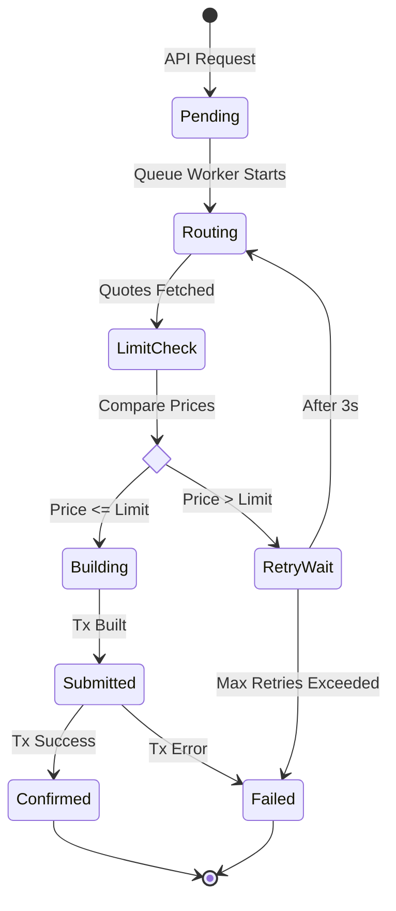

# Detailed Architecture & Implementation Guide

This document provides a technical deep-dive into the Order Execution Engine. It complements the high-level `README.md` by explaining *how* the system works internally, focusing on data flow, state management, and algorithm implementation.

## 🏗️ System Architecture

The system is built on a **Microservices-lite** architecture within a modular Monolith, separating concerns between API handling, Order Execution, and Queue Management.

### High-Level Component Diagram

```mermaid
graph TD
    Client[Client (HTTP/WS)] -->|POST Order| API[Fastify API Layer]
    Client <-->|WebSocket| WS[WebSocket Manager]
    
    API -->|Create| DB[(PostgreSQL)]
    API -->|Enqueue| Queue[BullMQ (Redis)]
    
    Queue -->|Process Job| Worker[Order Worker]
    
    subgraph Execution Engine
        Worker -->|1. Fetch| Service[LimitOrderService]
        Service -->|2. Route| Router[MockDexRouter]
        Service -->|3. Update Status| WS
        Service -->|4. Persist| DB
    end
    
    Router -.->|Simulate| Raydium[Raydium Quote]
    Router -.->|Simulate| Meteora[Meteora Quote]
```

---

## 🔄 Order Lifecycle & State Machine

The core of the engine is the `LimitOrderService`, which acts as a state machine for each order.

### State Transition Diagram



### Detailed Flow Explanation

1.  **Pending**: Order is saved to DB and added to BullMQ.
2.  **Routing**: Worker picks up job. `MockDexRouter` fetches quotes from Raydium and Meteora in parallel (`Promise.all`).
    *   *Algorithm*: `effectivePrice = price * (1 - fee)`.
    *   *Selection*: Lowest effective price is chosen.
3.  **Limit Check**:
    *   If `bestPrice <= limitPrice`: Proceed to Building.
    *   If `bestPrice > limitPrice`: Check retry count.
        *   If `retries < 3`: Wait 3s (exponential backoff simulated) -> Goto Routing.
        *   If `retries >= 3`: Mark as `Failed`.
4.  **Execution**: System simulates transaction building and network submission delays (2-3s).
5.  **Confirmation**: `executedPrice` and `txHash` are generated and saved.

---

## 💻 Code-Level Deep Dive

### 1. Parallel Quote Fetching (Router)
Located in `src/dex/MockDexRouter.ts`.

We maximize performance by fetching quotes concurrently. This simulates real-world DeFi aggregators where latency is critical.

```typescript
// Concurrency for speed
const [raydiumQuote, meteoraQuote] = await Promise.all([
  this.getRaydiumQuote(tokenIn, tokenOut, amount),
  this.getMeteorQuote(tokenIn, tokenOut, amount),
]);

// Fee-adjusted pricing logic
const raydiumEffective = raydiumQuote.price * (1 - raydiumQuote.fee); // 0.3% fee
const meteoraEffective = meteoraQuote.price * (1 - meteoraQuote.fee); // 0.2% fee
```

### 2. Recursive Retry Logic
Located in `src/services/limitOrderService.ts`.

Instead of a simple loop, we use recursion to handle retries, allowing for clean state management and delay injection.

```typescript
private async checkLimitWithRetry(..., attempt: number = 1): Promise<boolean> {
  // 1. Success Case
  if (currentPrice <= limitPrice) return true;

  // 2. Failure Case
  if (attempt >= this.maxRetries) return false;

  // 3. Recursive Retry
  await this.sleep(3000); // Wait
  const newRoute = await this.dexRouter.routeOrder(...); // Re-fetch
  return this.checkLimitWithRetry(..., newRoute.effectivePrice, ..., attempt + 1);
}
```

### 3. WebSocket Subscription Map
Located in `src/websocket/wsManager.ts`.

We use a `Map<OrderId, Set<WebSocket>>` data structure. This allows multiple clients (e.g., mobile app + web dashboard) to subscribe to the *same* order updates simultaneously without conflict.

```typescript
// One order -> Multiple listeners
private connections: Map<string, Set<WebSocket>> = new Map();

emit(orderId: string, message: WebSocketMessage) {
  const sockets = this.connections.get(orderId);
  if (sockets) {
    sockets.forEach(socket => {
        if (socket.readyState === WebSocket.OPEN) socket.send(...);
    });
  }
}
```

---

## 📊 Data Models

### Database (Prisma)
*   **Order**: The source of truth.
*   **OrderHistory**: An append-only log of every status change. Useful for auditing and debugging "why did this order fail?".

### Queue (BullMQ)
*   **Concurrency**: Set to `10`. This means 10 orders can be processed exactly at the same time.
*   **Rate Limiting**: Configured to handle bursts up to 100 orders/minute.

---

## 🛡️ Error Handling Strategy

1.  **Validation**: Zod schemas at API entry point (Bad Request 400).
2.  **Execution Errors**: Caught in `processLimitOrder` try/catch block.
    *   Updates DB status to `failed`.
    *   Saves `errorReason`.
    *   Emits WebSocket `failed` event.
3.  **System Crashes**: BullMQ guarantees job persistence. If the server crashes mid-process, the job remains in Redis and can be retried or inspected on restart.
